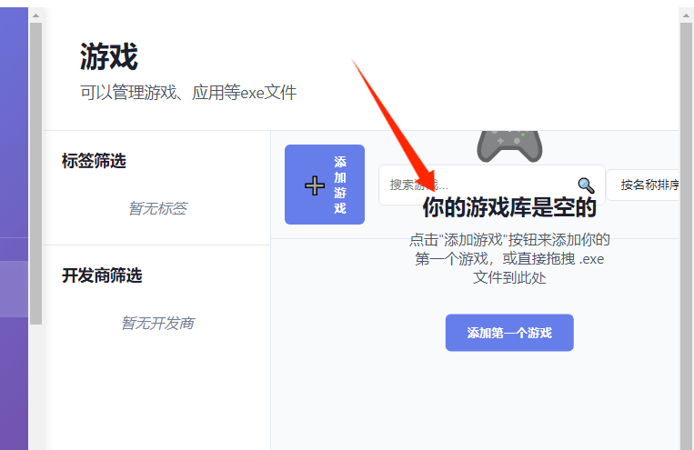

## TODO

1. 所有的资源，在保存封面图的时候，应该单独保存到cover文件夹里面
2. 游戏的截图文件夹逻辑需要改进，当重命名之后，不应该新建一个新的文件夹
3. 左侧的tag列表应该可以单独滚动
4. 多加几个主题
5. 不应该对同名的游戏文件报告重复，而是同名而且同文件夹，但是不同路径

## BUG记录

- 在没有游戏的时候，排版会错位

- 运行《巫女姫淫魔传》的时候，游戏结束了也会继续进行游戏。

  - 游戏启动
    ↓
    启动器进程被 spawn（PID: 32008）
    ↓
    系统记录 PID: 32008 到 gameProcesses
    ↓
    尝试获取窗口标题 → 失败（窗口未创建或无法识别）
    ↓
    启动器进程 1 秒后退出
    ↓
    触发 exit 事件 → 发送 game-process-ended
    ↓
    系统从 gameProcesses 中移除 PID: 32008
    ↓
    但实际游戏进程（可能是子进程，PID 不同）仍在运行
    ↓
    定期检查时，使用旧的 PID（3308, 54636）检查
    ↓
    getAllWindowTitlesByPID 返回 success: true, windowTitles: []
    ↓
    代码误判：进程存在但没有窗口 → 认为仍在运行
    ↓
    结果：游戏显示"运行中"，继续累加时间
  - 
  - 暂无解决方案
- 如果在记录游戏的瞬间，关闭电源/电脑死机，可能导致记录部分的存档丢失，比如game.json

  - 尝试用副本来增加备份
  - 尝试全部使用原子操作，还是不行
  - 暂无有效解决方案

## 更新日志

### 0.6.7

功能新加

- 游戏的资源刮削
- 数据详情页内容显示大改，包含主观内容，客观内容等
- 增加收藏功能

### 0.6.6

功能新加

- 可以添加游戏文件夹作为合集
- 网站管理可以导入书签，快速注册
- 将页面的左侧导航栏加上二级。比如应用下面，包含软件和游戏。图片下面包含漫画和单图

- 桌宠功能

体验优化：

- 侧边栏可以调整大小
- 侧边栏包含自己的子栏目
- 侧边栏的子栏目可以自定义
- 侧边栏的主栏增加各自的主页面
- 侧边栏的顺序可以调整
- 还有个小提议，选择缩略图里可不可以选择视频，然后自动从视频中截取一帧作为封面
- 图片默认读取第一张作为封面
- 游戏的截图默认选择第一张作为封面
- 确认框，调整，不再默认使用chrome的alert和confirm

### 0.6.5

bug修复

- 添加文件夹之后，还是被判断为空的，只有添加视频之后才判断为正常
- 增加图标的尺寸适配

重构

- 重构css为sass

功能新加

- 可以自定义背景
- 让游戏，漫画可以添加压缩包
- 让游戏可以添加bat
- 自动压缩zip
- 自动解压zip
- rar可以读取密码表自动解压
- 主页
- 主页包含为您推荐和最近浏览

体验优化

- 一般这种子页面在其他软件是点击子页面外部区域会自动消失，但是这个好像是在子页面外部区域结束点击也会退出。比如说我在复制子页面的东西时，会划取一部分文字，可能会在子页面区域外结束鼠标的点击，结果自动退出编辑页面了
- 删除APP上方的原生菜单
- 修复“你的xxx是空的”这个提示语错位问题
- 隐藏默认的菜单栏
- 

### 0.6.4

重构：

- 重构小说页面的代码
- 重构音频页面的代码
- 设置页重构
- 帮助页重构

功能新加

- 增加原生flash支持，也可以自选flash播放器
- 增加小说页面的pdf支持
- 增加小说页面的epub的支持

体验优化：

- 筛选器新增：选择丢失的资源
- 给帮助页加一个加群信息和关于我们，样式调整

bug修复

- 修复运行游戏时工作目录会默认用管理器目录的bug，现在可以正常打开《白コキ黒コキ ～黒タイツに責められるがそれぐらいでは白ニーソをあきらめない俺～》
- 修复qq群链接写错的问题（

### 0.6.3

重构：

- css结构重构，拆分多个css
- 重构游戏页面的代码
- 重构漫画页面的代码
- 重构视频页面的代码

体验优化：

- tag筛选栏有独立的滚动条
- 添加游戏时，不会默认写入未知开发商，而是默认空字符串
- 游戏页的tag显示从3增加到9

### 0.6.2

重构：

- electron.js超大规模重构，狠狠整理石山

功能新增

- 新增强制结束游戏，现在在运行时点击开始游戏的按钮可以强制结束游戏

### 0.6.1

重构

- 增加保存的稳定性，在多个保存任务并发时，使用队列一一保存，而不是同时保存

功能新增

* 存档备份功能，可以设置定时存档备份，并且每次写入存档时会创建backup文件，保护文件

体验优化：

- 减少游戏时的保存频率，现在每隔1分钟会保存一下时长

### 0.6.0

重构

- 使用ts重构，不用js了

**Bug修复**

* 修复切换页面后，游戏不显示运行时长的bug
* 修复修正图片浏览次数的bug，之前是只要查看就算浏览一次，改为只有点进播放器才算查看
* 修复看漫画时会卡第一页的问题
* 成就不保存问题

**功能新增**

* 自动更新功能
* 增加成就和个人页
* 增加伪装模式，并且让文本和图片可以替换

**体验优化**

* toast的信息更加人性化
* 视频时长会自动更新，不用手动点更新了
* 所有页面代码大规模重构
* 修复看漫画时会卡第一页的问题
* 图片的伪装模式

### 0.4.0

功能新增

* 游戏读取和运行
* 游戏时长统计
* 运行游戏时提示正在运行，以及记录第一次运行的时间
* 新增游戏、图片、视频、小说、网站和声音的页面和基本功能
* 视频播放器在新窗口打开额外视频
* 视频可以读取缩略图，并将视频的缩略图保存到本地
* 视频和音频时长的获取
* 开机自启，最小到托盘
* 全局音频播放器

### 0.0.1

- 项目新建
